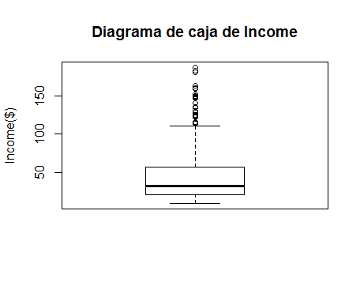

# Analysis of Credit data obtained from the ISLR package

## 1 – Descripción de la base de datos

La base de datos utilizada en el siguiente informe fue obtenida del paquete ISLR y se llama
Credit. 
La misma contiene información de balances de crédito de las tarjetas de 400 clientes. 

El objetivo del set de datos es predecir que clientes no van a pagar su deuda.

La base de datos contiene 400 elementos y tiene 11 variables que son:

* `Income`: ingreso en decenas de miles de dólares.

* `Limit`: límite de crédito.

* `Rating`: puntaje de crédito.

* `Cards`: número de tarjetas de crédito.

* `Age`: edad en años.

* `Education`: número de años de educación.

* `Gender`: Masculino o Femenino.

* `Student`: Si o No dependiendo si la persona fue estudiante.

* `Married`: Si o No dependiendo si la persona estuvo casada.

* `Ethnicity`: indicador de la etnia de la persona (Afro-Americano, Caucásico o Asiático).

* `Balance`: Promedio del balance de la tarjeta de crédito en dólares

```r
def hello(name):
  print "Hello " + name
```


